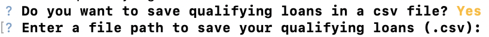

# Loan Qualifier Application

This is a python command-line interface application that allows users to see qualifying loans from lenders quickly and easily. The application works by taking in a `daily_rate_sheet` of loan criteria from various loan providers, asking the user a number of questions to evaluate their loan eligibility, and then returning to them the number of their qualifying loans. 

It also asks the user whether they want to save the resulting qualifying loans into a csv file, and if yes, ask for an output file path. 

---

## Technologies

This project leverages python 3.7 with the following packages:

* [fire](https://github.com/google/python-fire) - For the command line interface, help page, and entrypoint.

* [questionary](https://github.com/tmbo/questionary) - For interactive user prompts and dialogs

---

## Installation Guide

Before running the application first install the following dependencies.

```python
  pip install fire
  pip install questionary
```

Or you can use the `requirements.txt` file provided in this repo to install all dependencies using:

```python
  pip install -r requirements.txt
```

---

## Usage

To use the loan qualifier application simply clone the repository and run the **app.py** with:

```python
python app.py
```

Upon launching the loan qualifier application you will be asked the following questions:


The stadard output of the application will be as follows: 


The app will next ask you if you want to save the results in a csv file, and if yes, it will ask for an output file path:


---

## Contributors

Ahmad Takatkah, as part of [Berkeley Fintech Bootcamp](https://bootcamp.berkeley.edu/fintech/).

---

## License

MIT
