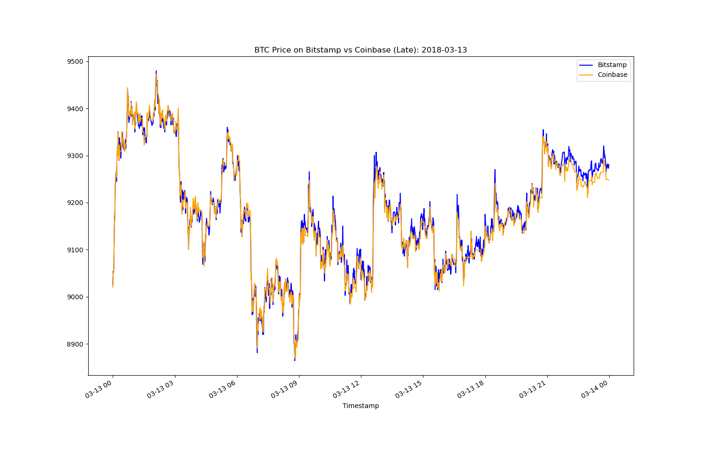

# Crypto_Arbitrage
This is a a jupyter lab notebook that analyzes Bitcoin prices from two different exchanges to find arbitrage trading opportunities. 

After reading and cleaning the data, it condusct a time series analysis to identify three different dates when arbitrage was availabe, and calculates arbitrage spread and spread returns, then identifies profitable trades at those times, and calculates profits prer trade and the cumulative profits that could've been made on all three different dates. 

---

## Technologies

This project leverages python 3.7 in a Jupyter Lab notebook utilizing: 

* [Pandas](https://github.com/pandas-dev) - A powerful data manipulation tool for Python.


---

## Installation Guide

Before running the application first install the following dependencies.

```python
  # conda
  conda install pandas
```

Or,

```python
   # PyPI  
   pip install pandas
```

---

## Usage

To use the crypto arbitrage notebook, activate your conda environment, then navigate to Crypto_Arbitrage folder, then launch Jupyter Lab in Terminal:

```python
   jupyter lab
```

After launching the notebook, you can read prices from two csv files: `bitstamp.csv` and `coinbase.csv` and store them into DataFrames, then go through the process of collecting, preparing, and analyzing and comparing price data from both files.

You can experiment with different date by changes the early, middle, and late dates: 

```python
   early_date = '2018-01-28'
   middle_date = '2018-02-06'
   late_date = '2018-03-13'
```

### You can visualize price differences from both exchanges on every date in an overlay plot:




### You can visualize profits per trade on every date in an overlay plot:


### You can visualize cumulative profits on every date in an overlay plot:


### Colnclusion:
After analyzing multiple early, middle, and late date, the data shows that arbitrage trading was the highest in the early dates, then over time it was diminishing. This makes sense as more people wanted to capture available arbitrage, which results in creating a balanced priced in both exchanges. 

---

## Contributors

Ahmad Takatkah, as part of [Berkeley Fintech Bootcamp](https://bootcamp.berkeley.edu/fintech/).

---

## License

MIT
