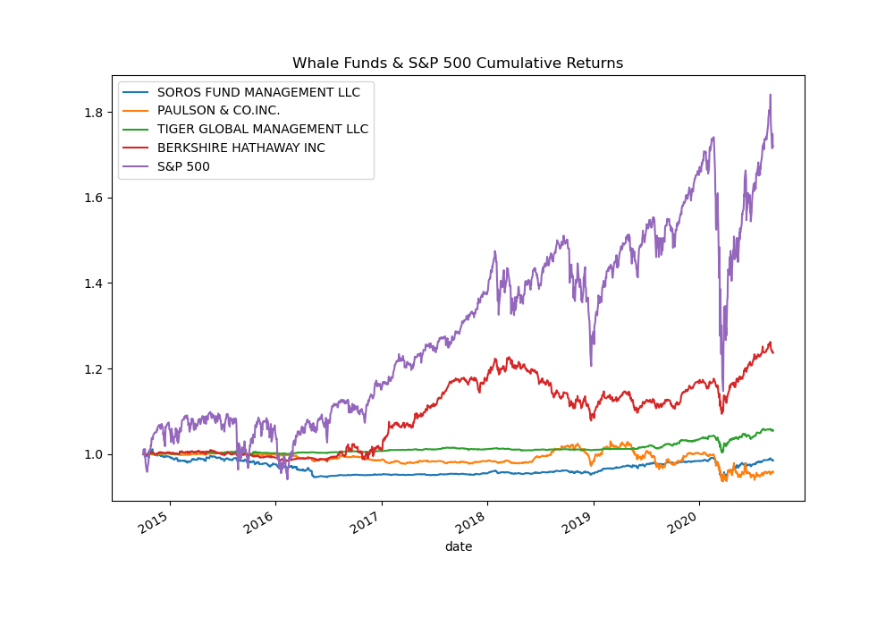
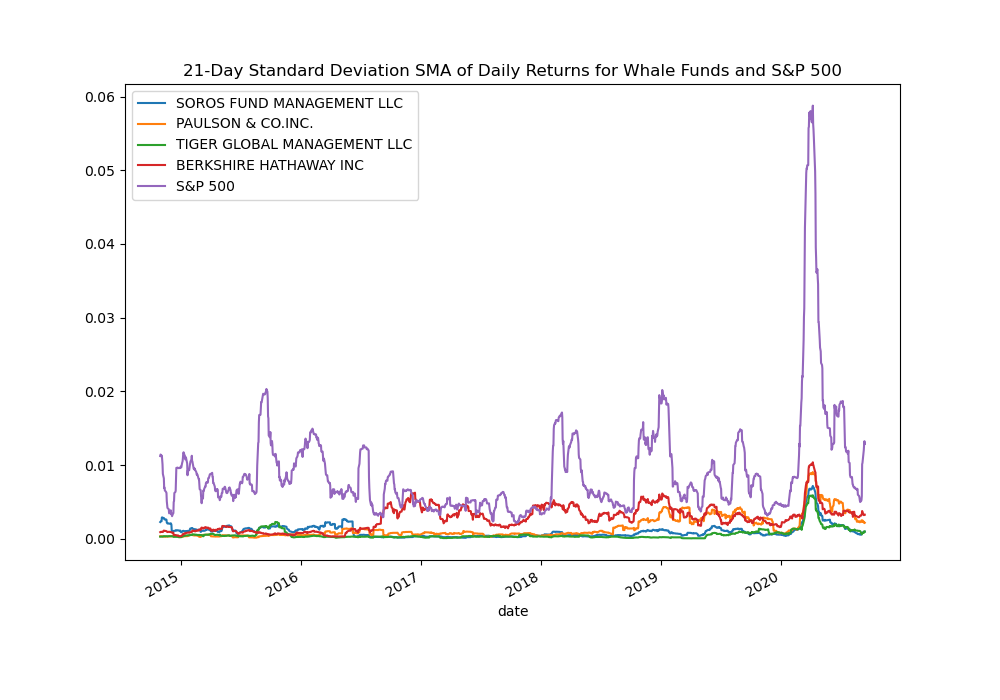
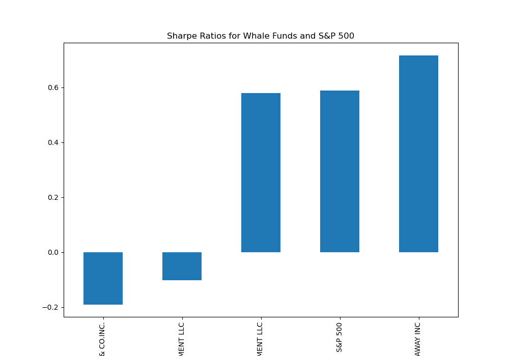

# Risk Return Analysis
This is a a jupyter lab notebook to evaluate four new fund investment options for inclusion in the client portfolios. This is done by choosing the fund with the most investment potential based on key risk-management metrics: the daily returns, standard deviations, Sharpe ratios, and betas.

---

## Technologies

This project leverages python 3.7 in a Jupyter Lab notebook utilizing: 

* [Pandas](https://github.com/pandas-dev) - A powerful data manipulation tool for Python.


---

## Installation Guide

Before running the application first install the following dependencies.

```python
  # conda
  conda install pandas
```

Or,

```python
   # PyPI  
   pip install pandas
```

---

## Usage

To use the Risk Return Analysis notebook, activate your conda environment, then navigate to risk_return_analysis folder, then launch Jupyter Lab in Terminal:

```python
   jupyter lab
```

After launching the notebook, you can read price data from the csv file in the `resources` folder: `whale_navs.csv` and store them into the `whale_navs` DataFrame, then go through the process of calculating daily returns and analyzing those four investment opportunities.

### You can visualize Whale Funds & S&P 500 Cumulative Returns in an overlay plot:



### You can visualize the 21-Day Standard Deviation SMA of Daily Returns for Whale Funds and S&P 500 in an overlay plot:



### You can visualize the Sharpe Ratios for Whale Funds and S&P 500 in an overlay plot:




### Colnclusion:
After analyzing the four whale funds performance, volatility, risk, sharpe rations, and betas in com,parison to the market represented by the S&P 500 Index, you build an idea of the investment opportunity's risk-return profile. This helps in selecting the investment (or fund in this case) that matches the risk profile of the client based on their goals and age.  

---

## Contributors

Ahmad Takatkah, as part of [Berkeley Fintech Bootcamp](https://bootcamp.berkeley.edu/fintech/).

---

## License

MIT