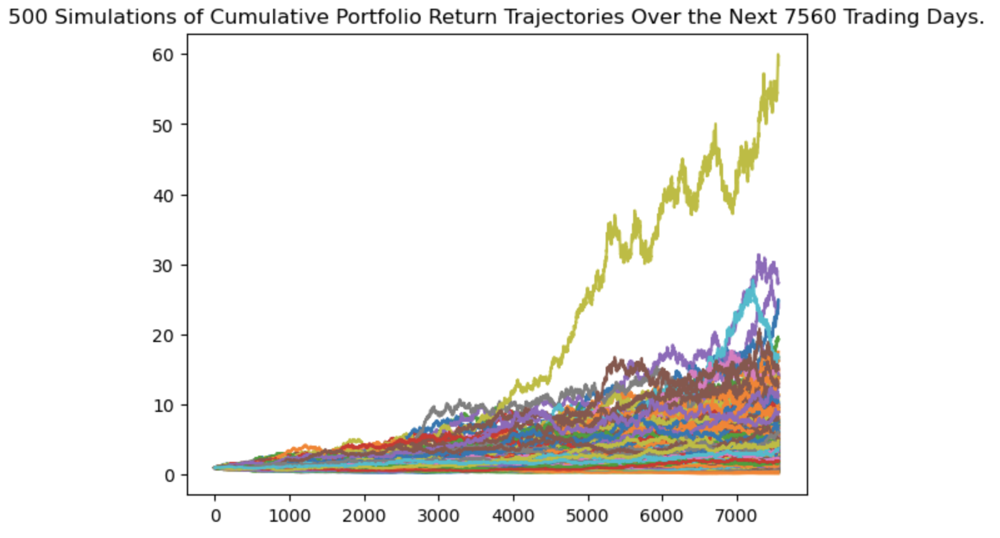
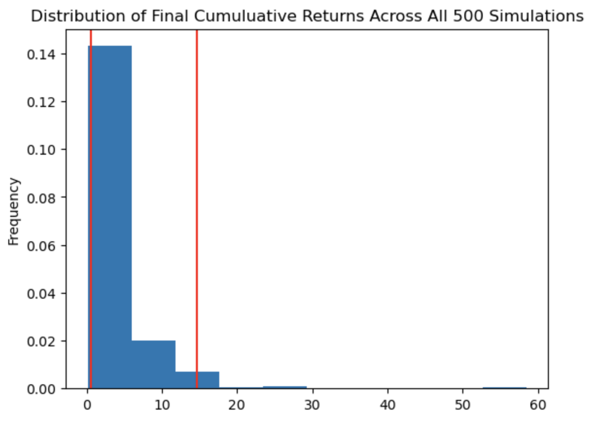

# Financial Planning Tools
This is a a jupyter lab notebook to create two financial analysis tools:

1. A financial planner for emergencies. Users will be able to use this tool to visualize their current savings and determine if they have enough reserves for an emergency fund.

2. A financial planner for retirement. This tool will forecast the performance of a retirement portfolio in 30 years and in 10 years with different stock/bond weights. To do this, the tool will make an Alpaca API call via the Alpaca SDK to get historical price data for use in Monte Carlo simulations.

---

## Technologies

This project leverages python 3.7 in a Jupyter Lab notebook utilizing: 

* [Pandas](https://github.com/pandas-dev) - A powerful data manipulation tool for Python.
* [Requests library](https://github.com/psf/requests) - An elegant and simple HTTP library for Python
* [JSON library](https://pypi.org/project/orjson/) - A fast, correct Python JSON library supporting dataclasses, datetimes, and numpy
* [dotenv Library](https://pypi.org/project/python-dotenv/) - A library to read key-value pairs from a .env file and set them as environment variables (Used in this project to save API keys)
* [Alpaca API and SDK](https://alpaca.markets/) - API for Stock and Crypto Trading

---

## Installation Guide

Before running the application first install the following dependencies.

```python
  # conda
  conda install pandas
```

```python
  # conda
  install -c anaconda requests
```

```python
  # conda
  conda install -c jmcmurray json
```

```python
   # PyPI  
   pip install python-dotenv
```

```python
   # PyPI  
   pip install alpaca-trade-api
```

To verify installations:

```python
  # conda
  conda list python-dotenv
  conda list alpaca-trade-api
```

---

## Usage

To use the Financial Planning Tools notebook, activate your conda environment, then navigate to the folder that contains the notebook, then launch Jupyter Lab in Terminal:

```python
   jupyter lab
```

After launching the notebook, you can set the Alpaca API parameters as follows:

```python
# Set the variables for the Alpaca API and secret keys saved in your own .env file in the same working directory
alpaca_api_key = os.getenv("ALPACA_API_KEY")
alpaca_secret_key = os.getenv("ALPACA_SECRET_KEY")

# Create the Alpaca tradeapi.REST object
api = tradeapi.REST(
    alpaca_api_key,
    alpaca_secret_key,
    api_version="v2"
)
```

Then you can call the API to get the needed prices in the needed timeframse as follows: (more detailed syntax in the Jubyter Notebook)

```python
portfolio_prices_df = api.get_bars(
    tickers = ,
    timeframe = ,
    start = ,
    end = 
).df
```


### You can visualize the Monte Carlo simulation cumulative portfolio returns trajectories over the next X number of trading days:



### You can visualize the probability distribution of the Monte Carlo simulation over the Y number of simulations:


 

---

## Contributors

Ahmad Takatkah, as part of [Berkeley Fintech Bootcamp](https://bootcamp.berkeley.edu/fintech/).

---

## License

MIT