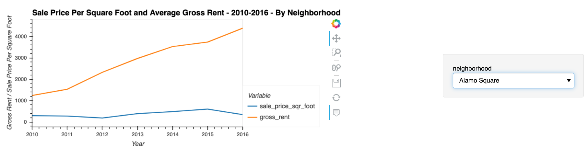

# Housing Rental Analysis for San Francisco
This is a a jupyter lab notebook to to use your data visualization skills, including aggregation, interactive visualizations, and geospatial analysis, to find properties in the San Francisco market that are viable investment opportunities.

---

## Technologies

This project leverages python 3.7 in a Jupyter Lab notebook utilizing: 

* [Pandas](https://github.com/pandas-dev) - A powerful data manipulation tool for Python.
* [PyViz Package](https://pyviz.org/) - Python tools for data visualization, specifically the following two libraries: hvPlot and GeoViews. 

---

## Installation Guide

Before running the application first install the following dependencies.

```python
  # conda
  conda install pandas
```

```python
  # conda
  conda install -c pyviz hvplot geoviews
```

To verify installations:

```python
  # conda
  conda list hvplot
  conda list geoviews
```

---

## Usage

You can use the san_francisco_housing.ipynb notebook to visualize and analyze the real-estate data.

You need to first read the sfo_neighborhoods_census_data.csv file from the Resources folder into the notebook and create the DataFrame that you’ll use in the analysis.

The main task is to visualize and analyze the real-estate data. You can use the san_francisco_housing.ipynb notebook to complete the following tasks:

* Calculate and plot the housing units per year.

* Calculate and plot the average prices per square foot.

* Compare the average prices by neighborhood.

* Build an interactive neighborhood map.

* Compose a data story for SF neighborhoods.


### You can visualize Housing Units growth in San Francisco between 2010 and 2016:


### You can visualize Sale price and Gross rent by neighborhood in the same time period (notice the drop down menu to select neighborhoods):


 
### You can Build an Interactive Neighborhood Map:


---

## Contributors

Ahmad Takatkah, as part of [Berkeley Fintech Bootcamp](https://bootcamp.berkeley.edu/fintech/).

---

## License

MIT