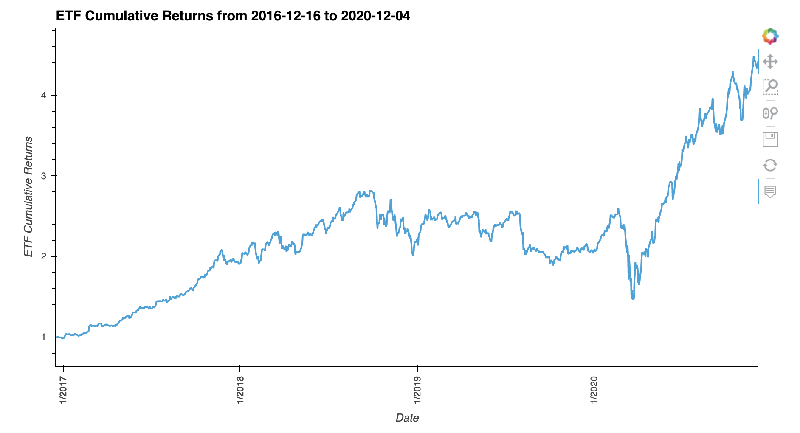
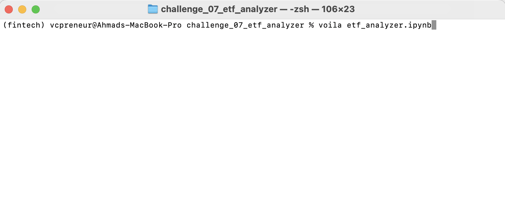
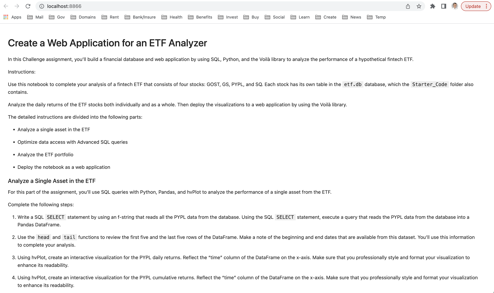

# Housing Rental Analysis for San Francisco
This is a a jupyter lab notebook to build a financial database and web application by using SQL, Python, and the Voilà library to analyze the performance of a hypothetical fintech ETF.

---

## Technologies

This project leverages python 3.7 in a Jupyter Lab notebook utilizing: 

* [Pandas](https://github.com/pandas-dev) - A powerful data manipulation tool for Python.
* [PyViz Package](https://pyviz.org/) - Python tools for data visualization, specifically the following two libraries: hvPlot and GeoViews. 
* [SQLAlchemy](https://www.sqlalchemy.org/) - Python SQL toolkit and Object Relational Mapper that gives application developers the full power and flexibility of SQL.

---

## Installation Guide

Before running the application first install the following dependencies.

```python
  # conda
  conda install pandas
```

```python
  # conda
  conda install -c pyviz hvplot 
```

```python
  # PyPI
  pip install SQLAlchemy 
```

---

## Usage

You can use the etf_analyzer.ipynb notebook to visualize and analyze the ETF portfolioa.

You need to first create a database connection engin to read the data in `etf.db` file, then query the database into a DataFrame that you’ll use in the analysis.

After analyzing on of the stocks included in the ETF, you can also analyze all stocks, calculate daily returns and cumulative returns for the ETF porfolio and then plot the returns as follows:




### You can use Voilà library to deploy your notebook as a web application using the following code in terminal (inside the file's working directory) and after activating your conda environment:

```python
  # conda
  voila etf_analyzer.ipynb 
```
### This is a screenshot of the terminal command: 


### This is a screenshot of the deployed notebook as an html web application on your local host (your laptop):


### Finally, you can find the html saved file in this challenge working directory. 


---

## Contributors

Ahmad Takatkah, as part of [UC Berkeley Fintech Bootcamp](https://bootcamp.berkeley.edu/fintech/).

---

## License

MIT