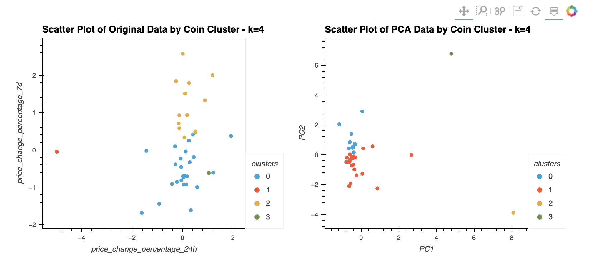

# Crypto Returns Clustering
This is a a jupyter lab notebook to explore the effect of PCA data reduction on unsupervised machine learning, specifically, clustering using KMeans. The sample data we're using here is various crypto returns data.  

---

## Technologies

This project leverages python 3.7 in a Jupyter Lab notebook utilizing: 

* [Pandas](https://github.com/pandas-dev) - A powerful data manipulation tool for Python.
* [PyViz Package](https://pyviz.org/) - Python tools for data visualization, specifically the following two libraries: hvPlot and GeoViews. 
* [sklearn](https://scikit-learn.org/stable/) - Simple and efficient tools for predictive data analysis in Python.

---

## Installation Guide

Before running the application first install the following dependencies.

```python
  # conda
  conda install pandas
```

```python
  # conda
  conda install -c pyviz hvplot 
```

```python
  # PyPI
  pip install -U scikit-learn 
```

---

## Usage

You can use the crypto_investments.ipynb notebook to visualize and analyze PCA effects on clustering.

You need to first prepare the data before running the K-Means algorithm. We use the `StandardScaler` module from scikit-learn to normalize the CSV file data. This will require you to utilize the `fit_transform` function. 

Then we will try to find the best value for k using the original data, and then using the reduced PCA data. You will notice that the PCA reduction didn't affect the best k value. 


Finally, we will cluster the data using both, the original data and the reduced PCA data. You will notice that when using the PCA data, clusters are more visually recognized and less overlapped.



---

## Contributors

Ahmad Takatkah, as part of [UC Berkeley Fintech Bootcamp](https://bootcamp.berkeley.edu/fintech/).

---

## License

MIT