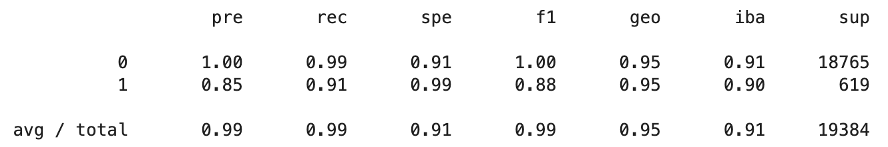
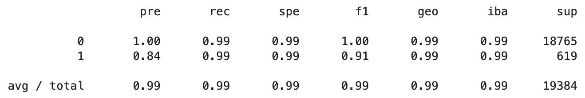

# Credit Risk Classification
This is a a jupyter lab notebook to use various techniques to train and evaluate models with imbalanced classes. It uses a dataset of historical lending activity from a peer-to-peer lending services company to build a model that can identify the creditworthiness of borrowers.

---

## Technologies

This project leverages python 3.7 in a Jupyter Lab notebook utilizing: 
 
* [sklearn](https://scikit-learn.org/stable/) - Simple and efficient tools for predictive data analysis in Python.
* [imbalanced-learn](https://imbalanced-learn.org/stable/) - An open source, MIT-licensed library relying on scikit-learn and provides tools when dealing with classification with imbalanced classes.
* [pydotplus](https://pypi.org/project/pydotplus/) - A Python interface to Graphviz's Dot language.

---

## Installation Guide

Before running the application first install the following dependencies.

```python
  # PyPI
  pip install -U scikit-learn 
```

```python
  # conda
  conda install -c conda-forge imbalanced-learn
```

```python
  # conda
  conda install -c conda-forge pydotplus
```

---

## Usage

First we need to import the data, and split it into a training set and a testing set. Then separate features from target. 

Then we create a Logistic Regression Model with the Original Data forllowing the model-fit-predict process, and then print out the classification report: 



Then we do the excat same steps but after resampling the data, in this case, over-sampling the data, and finally we print the new classification report: 



To read more about the interpretations and comparison of both reports please refer to the Report Template file included in this repo. 

---

## Contributors

Ahmad Takatkah, as part of [UC Berkeley Fintech Bootcamp](https://bootcamp.berkeley.edu/fintech/).

---

## License

MIT